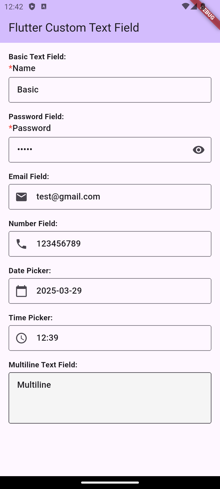
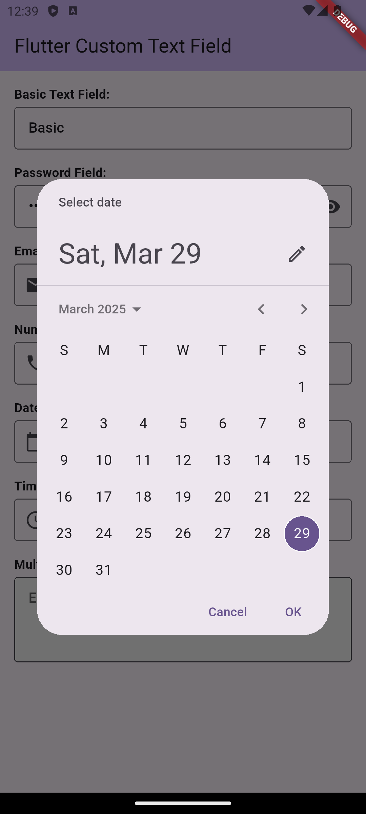
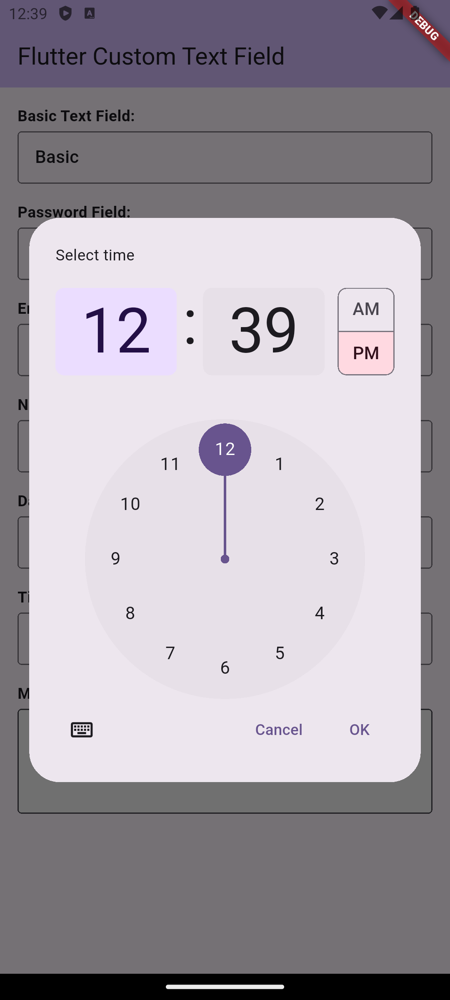
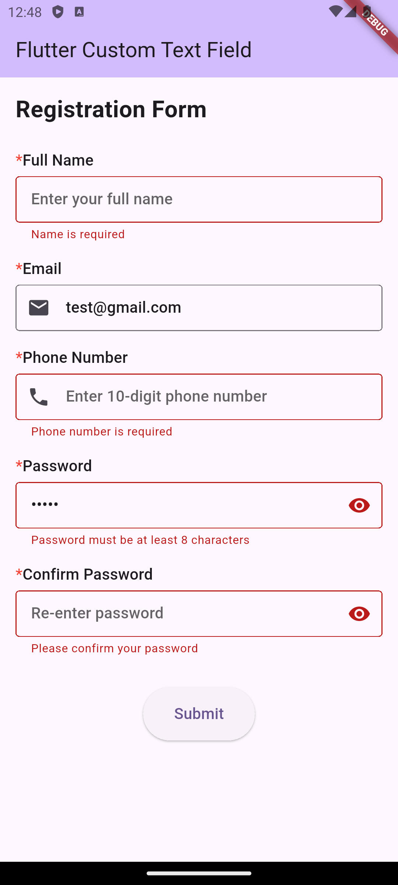

<!--
This README describes the package. If you publish this package to pub.dev,
this README's contents appear on the landing page for your package.

For information about how to write a good package README, see the guide for
[writing package pages](https://dart.dev/tools/pub/writing-package-pages).

For general information about developing packages, see the Dart guide for
[creating packages](https://dart.dev/guides/libraries/create-packages)
and the Flutter guide for
[developing packages and plugins](https://flutter.dev/to/develop-packages).
-->

# Custom Border Text Field

A feature-rich Flutter text field widget that offers date/time pickers, form validation, custom borders, icons, and error handling. Perfect for creating professional and user-friendly input forms.

## Screenshots






## Features

- Customizable border styling
- Support for prefix and suffix icons
- Configurable text input types
- Input formatting support
- Label and hint text customization
- Icon color customization
- Filled background option
- Date and time picker integration
- Form validation support
- Text selection control

## Getting started

Add this to your package's `pubspec.yaml` file:

```yaml
dependencies:
  custome_border_text_field: ^1.0.0
```

## Usage

```dart
import 'package:custome_border_text_field/custome_border_text_field.dart';

BorderTextField(
  labelText: 'Username',
  hintText: 'Enter your username',
  controller: _controller,
  prefixIcon: Icon(Icons.person),
  onChanged: (value) {
    print('Text changed: $value');
  },
  isMandatory: true,
  isLabelRequired: true,
);
```

### Parameters

#### Required Parameters
- `labelText` (String): Text label for the field
- `hintText` (String): Placeholder text shown when field is empty
- `onChanged` (Function): Callback function when text changes
- `controller` (TextEditingController): Controller for managing the text field

#### Optional Parameters
- `obscureText` (bool): Hide text input, useful for passwords
- `prefixIcon` (Widget?): Icon widget displayed before the text
- `sufixIcon` (Widget?): Icon widget displayed after the text
- `iconColor` (Color?): Color for the prefix and suffix icons
- `inputType` (TextInputType): Keyboard type (e.g., text, number, email)
- `inputFormatters` (List<TextInputFormatter>?): Text input formatting rules
- `filled` (bool): Enable/disable background fill
- `fillColor` (Color?): Background color when filled is true
- `errorMessage` (String?): Error message to display below the field
- `maxLine` (int?): Maximum number of lines for multiline input
- `maxLength` (int?): Maximum number of characters allowed
- `enable` (bool): Enable/disable user interaction
- `isMandatory` (bool): Show red asterisk (*) for required fields
- `isLabelRequired` (bool): Show/hide the label text
- `validator` (Function?): Form validation function
- `textAlign` (TextAlign?): Text alignment within the field

#### Date and Time Picker Options
- `isDatePicker` (bool): Enable date picker mode
- `isTimePicker` (bool): Enable time picker mode
- `firstDate` (DateTime?): Minimum selectable date
- `lastDate` (DateTime?): Maximum selectable date
- `timeOfDay` (TimeOfDay?): Initial time for time picker
- `is24Hour` (bool): Use 24-hour format for time picker

#### Layout and Visibility
- `marginTop` (int): Top margin for the field container
- `isVisible` (bool): Show/hide the entire field
- `enableCopy` (bool): Allow/disallow text copying
- `enableInteractiveSelection` (bool): Enable/disable text selection

## Additional information

Created by Amol Gahukar. For issues and feature requests, please visit the [GitHub repository](https://github.com/amolgahukar10/border_text_field).

## License

This project is licensed under the MIT License - see the LICENSE file for details.
